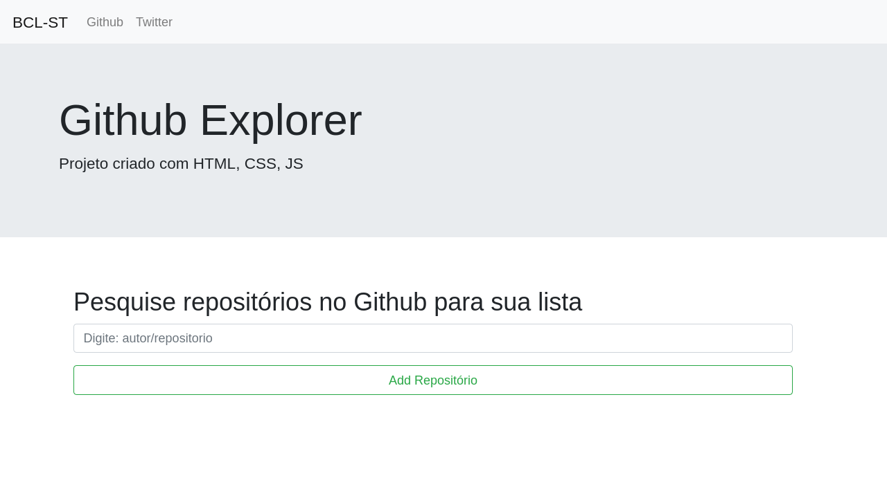
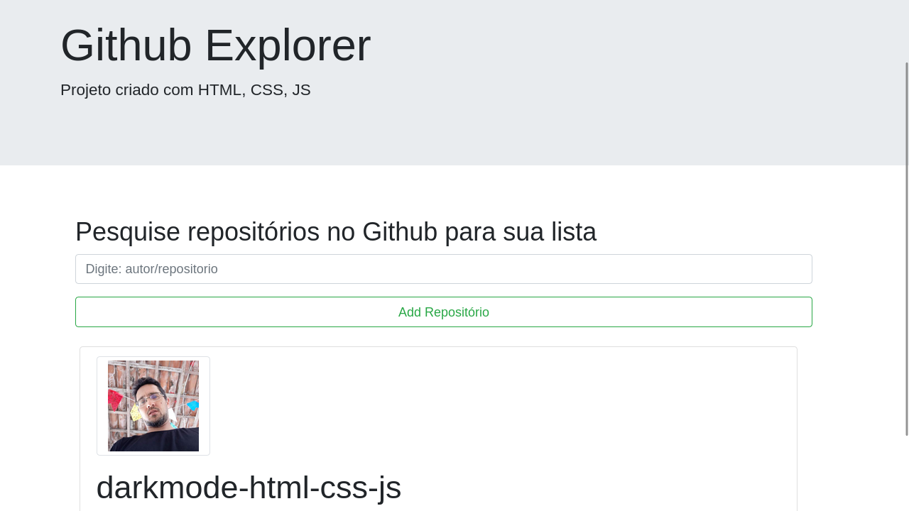
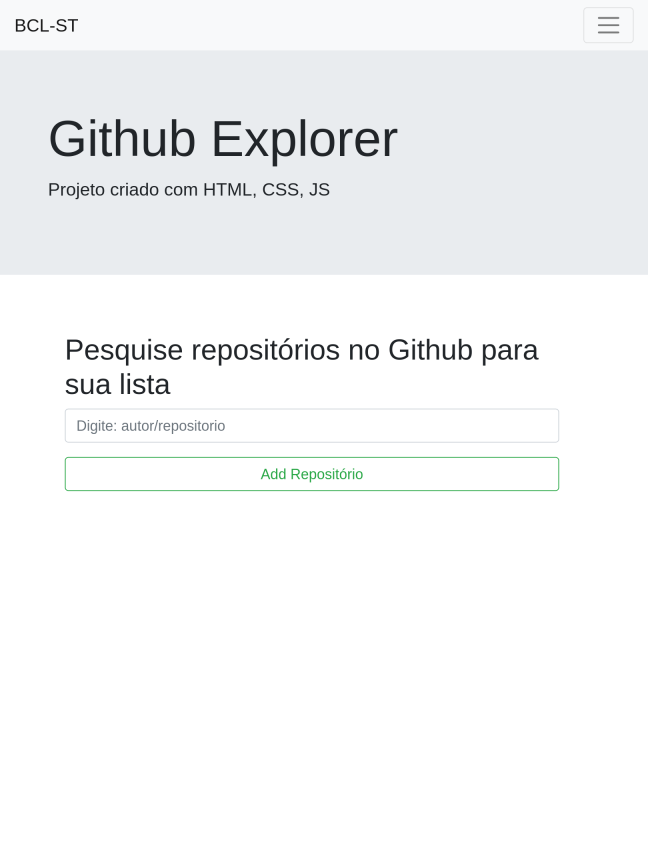
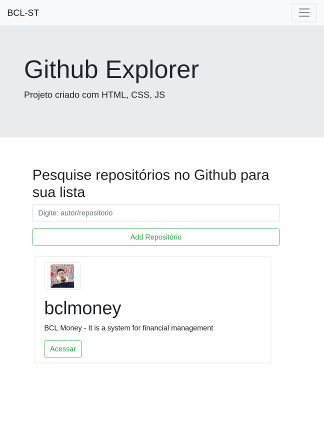

# Git Explorer

Esse projeto realiza uma consulta nos repositórios do github consumindo a API do mesmo e nos retorna alguns dados sobre o repositório com um link para acessa-lo.

### Tecnologias usada:

- HTML
- CSS
- JavaScript
- Bootstrap
- Babel
- Webpack

## Imagens





| Ipad 1 | Ipad 2 |
|----------|----------|
|  |   |
 

### Como Usar

```bash
git clone git@github.com:brennoclins/cs6-GithubExplorer.git

yarn install

yarn dev
```

Abra seu navegador web em : [Localhost:8080](http://localhost:8080)